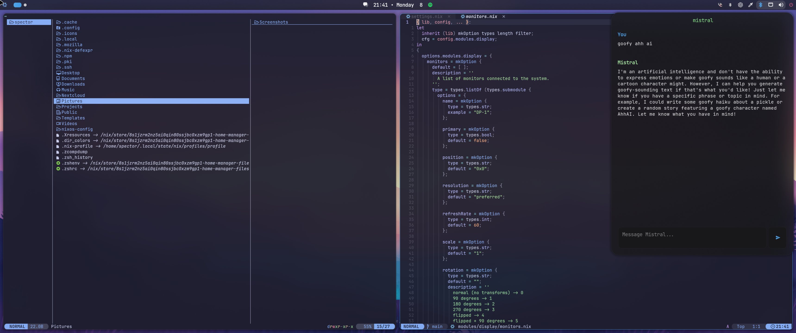
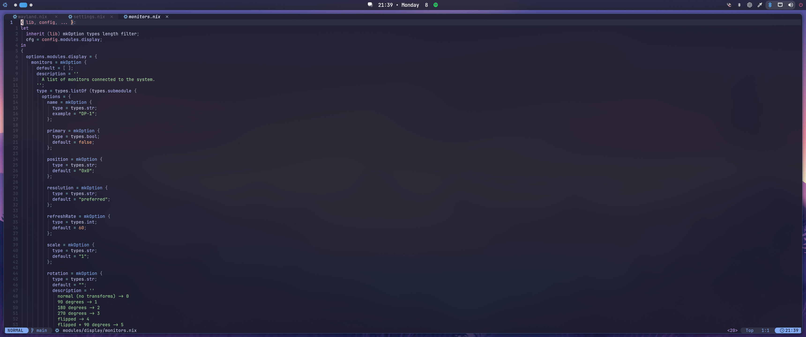

<p align="center"></p>

<p align="center">
<a href="https://nixos.org/"></a>

<p align="center"></p>

---

- **Window Manager** • Niri
- **Shell** • zsh with starship
- **Terminal** • Kitty
- **Panel** • Dank Material Shell
- **File Manager** • Yazi
- **Neovim** • [Akari](https://github.com/spector700/Akari)

---





<p align="center">Screenshots circa 2024-04-09</p>

---

## <samp>INSTALLATION (NixOS)</samp>

- Download the current NixOS minimal ISO from the unstable channel.

```bash
wget -O nixos-minimal.iso https://channels.nixos.org/nixos-unstable/latest-nixos-minimal-x86_64-linux.iso
```

- Boot Into the Installer.

- Format Partitions with Disko:

```bash
sudo nix --experimental-features "nix-command flakes" run github:nix-community/disko -- --mode disko --flake github:spector700/nixos-config#alfheim
```

- Install Dotfiles Using Flake

```bash
sudo nixos-install --flake github:spector700/nixos-config#alfheim --no-write-lock-file
```

- Reboot

## Updating and validating

Update flake inputs and review the resulting lock-file change:

```bash
just update
```

The repository also opens a weekly `flake.lock` update pull request through
GitHub Actions. Review that pull request before merging it.

Run the checks before switching a host:

```bash
nix flake check --all-systems
nix build .#nixosConfigurations.<host>.config.system.build.toplevel
```

Compare a host's active generation with a freshly built configuration:

```bash
just diff <host>
```

Deploy a host remotely over the configured SSH port:

```bash
just rebuild-deploy <host>
```

Test a configuration without making it the default boot entry:

```bash
sudo nixos-rebuild test --flake .#<host>
```

If a switch needs to be reverted, select an earlier generation from the boot
menu or run `sudo nixos-rebuild switch --rollback`.

# 💾 Inspiration

- [fufexan/dotfiles](https://github.com/fufexan/dotfiles)
- [linuxmobile/kaku](https://github.com/linuxmobile/kaku)
- [Gerg-L/nixos](https://github.com/Gerg-L/nixos)
- [Misterio77/nix-config](https://github.com/Misterio77/nix-config)
