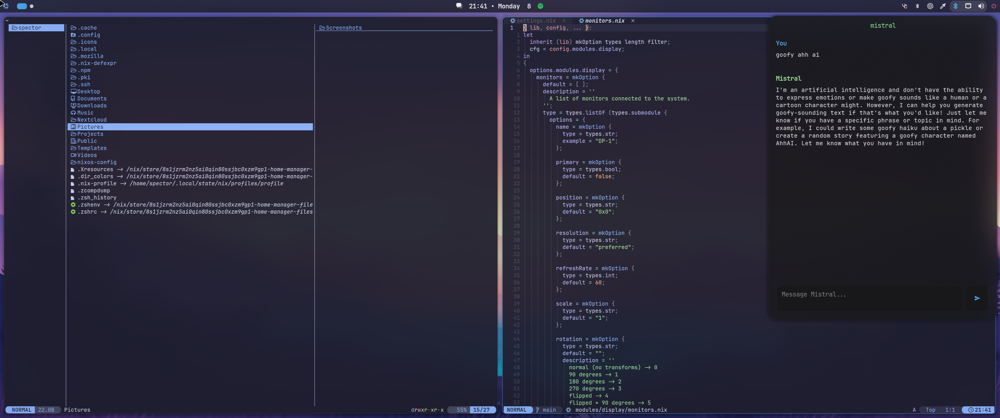

<p align="center"></p>

<p align="center">
<a href="https://nixos.org/"></a>

<p align="center"></p>

---

- **Window Manager** • [Hyprland](https://github.com/hyprwm/Hyprland)🎨
- **Shell** • [Zsh](https://www.zsh.org) 🐚 with
  [starship](https://github.com/starship/starship)
- **Terminal** • [Kitty](https://sw.kovidgoyal.net/kitty/) 💻
- **Panel** • [AGS](https://github.com/Aylur/ags)🍧
- **Launcher** • [AnyRun](https://github.com/Kirottu/anyrun) 🚀
- **File Manager** • [yazi](https://yazi-rs.github.io)🔖
- **Neovim** • [Akari](https://github.com/spector700/Akari)

---




<p align="center">Screenshots Circa: 2024-4-9</p>

---

## <samp>INSTALLATION (NixOS)</samp>

- Download ISO.
```bash
wget -O https://channels.nixos.org/nixos-23.05/latest-nixos-minimal-x86_64-linux.iso
```

- Boot Into the Installer.

- Format Partitions with Disko:

```bash
sudo nix --experimental-features "nix-command flakes" run github:nix-community/disko -- --mode disko --flake github:spector700/nixos-config#alfhiem
```

- Install Dotfiles Using Flake

```bash
sudo nixos-install --flake github:spector700/nixos-config#alfhiem --no-write-lock-file
```

- Reboot

# 💾 Inspiration

- [fufexan/dotfiles](https://github.com/fufexan/dotfiles)
- [linuxmobile/kaku](https://github.com/linuxmobile/kaku)
- [Gerg-L/nixos](https://github.com/Gerg-L/nixos)
- [Misterio77/nix-config](https://github.com/Misterio77/nix-config)

---
<small align="center" >Intro Stolen from @linuxmobile</small>
